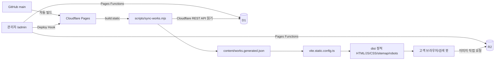

# ACEDENT 프로젝트 핸드오버

> 기준일: 2026-09-14
> 기준 브랜치/커밋: `main` / `b70c763` (`feat: add drag-and-drop admin image uploads`)
> 운영 사이트: <https://www.acedentshop.co.kr>
> 배포 대상: Cloudflare Pages 프로젝트 `acedent-git`
> 저장소: `concettimonte-hue/acedent`

이 문서는 에이스덴트 웹사이트의 기획·코드 검토 업무를 인수하는 AI가 코드베이스와 운영 구조를 빠르게 이해하기 위한 기준 문서다. 설명은 저장소의 현재 코드와 확인된 운영 이력을 기준으로 작성했다. 추측과 향후 제안은 별도로 표시한다.

---

## 0. 새 담당자가 가장 먼저 알아야 할 핵심

1. **운영 배포는 Vercel이 아니라 Cloudflare Pages다.** `main`에 push하면 `acedent-git` 프로젝트가 자동 빌드·배포한다.
2. **고객 페이지는 런타임에 D1을 조회하지 않는다.** 빌드 직전에 D1의 공개 사례를 `content/works.generated.json`으로 동기화하고, Vite가 각 URL의 정적 HTML을 생성한다.
3. **관리자만 Cloudflare Pages Functions를 통해 D1/R2에 접근한다.** `/admin`과 `/admin/*`는 Cloudflare Access One-time PIN으로 보호한다.
4. **데이터는 D1, 이미지는 R2가 원본 저장소다.** 공개 이미지 주소는 `https://images.acedentshop.co.kr`이다.
5. **실제 프로덕션 빌드는 `npm run build:static`이다.** `npm run build`는 Vinext 호환성 검증용 경로다. SEO·라우트 파일 생성의 실질적인 기준은 `vite.static.config.ts`다.
6. **기존 slug는 URL 자산이다. 절대 임의 변경하지 않는다.** 신규 slug만 현재 사전 기반 생성 규칙을 적용한다.
7. 작업 전에 반드시 `AGENTS.md`와 `git status --short`를 확인한다. 현재 사용자 소유의 미추적 파일이 있을 수 있으므로 요청받지 않은 파일을 스테이징하지 않는다.

---

## 1. 프로젝트 개요 (Project Overview)

### 1.1 사이트 목적

서울 동대문구의 자동차 외형복원 업체 **에이스덴트**의 공식 웹사이트다. 주 목적은 다음과 같다.

- 판금도색, 외형복원, 무도색 덴트, 부분도색, 교환도색, 광택·오염제거 서비스를 설명한다.
- 실제 전/후 사진을 통해 작업 품질을 먼저 보여준다.
- 고객이 자신의 손상과 비슷한 수리사례를 카테고리와 부위로 찾게 한다.
- 전화, 사진 문자, 네이버 톡톡으로 상담 전환을 만든다.
- 검색엔진이 지역·서비스·차종·작업 부위를 이해하도록 정적 HTML, 메타데이터, 구조화 데이터를 제공한다.
- 비개발자인 운영자가 `/admin`에서 사진과 내용을 입력해 사례를 등록·수정·삭제할 수 있게 한다.

### 1.2 타깃 사용자

#### 고객

- 동대문·성동·중랑·광진·성북 및 인근 지역에서 자동차 외장 수리가 필요한 사람
- 서비스 명칭을 정확히 모를 수 있으므로 전문용어보다 실제 손상과 결과 중심의 설명이 필요하다.
- 모바일에서 사진을 보고 곧바로 전화·문자·톡톡 상담으로 이동하는 비중이 높다.

#### 운영자

- 개발 지식 없이 휴대폰으로 작업 전/후 사진과 설명을 등록한다.
- 여러 작업을 연속 등록하고, 저장 후 실제 상세 페이지를 확인한다.
- 잘못 등록한 사례를 수정·삭제하고 R2 고아 파일을 점검한다.

### 1.3 핵심 비즈니스 로직

수리사례 한 건은 아래 역할을 분리한다.

```ts
interface WorkItem {
  category: WorkCategory;       // 주 작업 1개: 카테고리 URL·필터·slug 기준
  subCategories: WorkCategory[];// 보조 작업 0~2개: 상세 표시·검색용
  part: WorkPartValue[];        // 첫 값이 주 부위: slug·카드 첫 표기 기준
  subParts: WorkPartValue[];    // 보조 부위 0~2개: 상세 표시·검색용, 필터 제외
  parts: WorkPartMedia[];       // 실제 사진 묶음. 각 묶음은 작업 부위 1~3개
}

interface WorkPartMedia {
  part?: WorkPartValue[];       // 실제 작업 부위: /works 부위 필터 기준
  label: string;                // 예: "도어 · 휀더 조수석 측면"
  before: string;
  after: string;
  thumbnail?: string;
  note: string;
}
```

현재 역할 규칙은 매우 중요하다.

- `work.category`: 주 카테고리 1개. 카테고리 페이지, 카테고리 필터, slug에 사용한다.
- `work.subCategories`: 상세 페이지에만 보조 뱃지로 표시한다. 카테고리 필터와 slug에는 관여하지 않는다.
- `work.part[0]`: 첫 번째 PART의 첫 부위다. 신규 slug와 카드 표기의 첫 항목이다.
- `work.parts[].part[]`: 실제 작업 부위의 합집합이다. `/works` 부위 필터는 이 배열들만 모아 판단한다. 구형 데이터에 이 필드가 전혀 없을 때만 `work.part`를 호환 폴백으로 사용한다.
- `work.subParts`: 상세 표시·검색용 보조 태그다. `/works` 필터에는 절대 사용하지 않는다.

카드 부위 표시는 실제 작업 부위 개수에 따라 다음과 같다.

- 1개: `범퍼`
- 2개: `범퍼 · 사이드스텝`
- 3개 이상: `범퍼 외 2`

메인 페이지의 대표 사례는 `featured: true`인 사례를 `featuredOrder` 순으로 최대 8건 보여준다. 관리자 신규 등록은 현재 기본적으로 `featured: false`이며, 대표 8건의 디자인과 노출 순서를 보호하기 위한 결정이다.

---

## 2. 배포 및 인프라 환경 (Infrastructure)

### 2.1 운영 구성

| 항목 | 값/역할 |
|---|---|
| 소스 저장소 | GitHub `concettimonte-hue/acedent` |
| 프로덕션 브랜치 | `main` |
| 배포 플랫폼 | Cloudflare Pages |
| Pages 프로젝트명 | `acedent-git` |
| 프로덕션 도메인 | `https://www.acedentshop.co.kr` |
| 정적 빌드 명령 | `npm run build:static` |
| 출력 디렉터리 | `dist` |
| D1 데이터베이스 | `acedent-content` |
| D1 바인딩 | `ACEDENT_DB` |
| R2 버킷 | `acedent-images` |
| R2 바인딩 | `ACEDENT_IMAGES` |
| R2 공개 도메인 | `https://images.acedentshop.co.kr` |

GitHub `main` push가 Cloudflare Pages Git 연동 빌드를 시작한다. 관리자 저장은 Git commit을 만들지 않는다. 대신 Cloudflare Pages Deploy Hook을 호출해 동일한 `main` 소스로 재빌드하며, 빌드 시 최신 D1 내용을 다시 가져온다.

### 2.2 배포 데이터 흐름



이 구조를 선택한 이유는 다음과 같다.

- 고객 페이지는 D1 장애나 API 지연의 영향을 받지 않고 빠르게 제공된다.
- 검색 봇이 JavaScript를 실행하지 않아도 본문, 사례, FAQ, 링크를 읽을 수 있다.
- 관리자 기능만 동적 서버 기능을 사용하므로 운영 범위와 비용을 제한한다.
- D1을 향후 다른 CMS나 저장소로 교체해도 `content/works.generated.json`을 만드는 동기화 계층만 바꾸면 공개 페이지는 유지할 수 있다.

### 2.3 빌드 명령의 차이

`package.json`의 주요 스크립트:

```json
{
  "dev": "node scripts/sync-works.mjs && vinext dev",
  "build": "node scripts/sync-works.mjs && vinext build",
  "build:static": "node scripts/sync-works.mjs && vite build --config vite.static.config.ts",
  "content:sync": "node scripts/sync-works.mjs",
  "content:migrate:d1": "node scripts/migrate-works-to-d1.mjs"
}
```

- `npm run build:static`: 실제 Cloudflare Pages 프로덕션 빌드. `dist`를 만든다.
- `npm run build`: Vinext/Next 호환 계층의 컴파일 검증. 프로덕션 정적 라우트 파일을 만드는 기준 경로는 아니다.
- `npx tsc --noEmit`: 타입 검사.
- 완료 전 기본 검증 순서는 `npx tsc --noEmit`, `npm run build`, `npm run build:static`이다.

### 2.4 주요 설정 파일

#### `wrangler.jsonc`

실제 Cloudflare 리소스 이름과 바인딩의 기준이다.

```jsonc
{
  "name": "acedent",
  "compatibility_date": "2026-09-07",
  "pages_build_output_dir": "./dist",
  "vars": {
    "R2_PUBLIC_BASE_URL": "https://images.acedentshop.co.kr",
    "CLOUDFLARE_ACCOUNT_ID": "1da573d9f39f8d3a772f3074f7c20d0a",
    "CLOUDFLARE_PAGES_PROJECT": "acedent-git"
  },
  "d1_databases": [{
    "binding": "ACEDENT_DB",
    "database_name": "acedent-content",
    "database_id": "ada6a2b7-14ba-4c14-b9f1-d08e9be2e3ee"
  }],
  "r2_buckets": [{
    "binding": "ACEDENT_IMAGES",
    "bucket_name": "acedent-images"
  }]
}
```

주의할 점:

- `wrangler.jsonc.name`은 `acedent`지만 Git 연동 Pages 프로젝트는 `acedent-git`이다.
- `compatibility_date`가 현재 로컬에 설치된 Miniflare가 지원하는 날짜보다 새로워 `vinext dev`가 실패한 적이 있다. 정적 빌드는 정상이다. 자세한 내용은 7장을 참고한다.
- `[env.production]`, `[env.preview]` 블록은 현재 없다. Pages 대시보드에서 Preview/Production 바인딩을 따로 관리하는 경우 양쪽 설정을 점검해야 한다.

#### `vite.static.config.ts`

프로덕션 정적 빌드의 핵심 파일이다.

- `content/works.generated.json`을 읽는다.
- 기본 `index.html`에 AutoBodyShop, Organization, FAQPage JSON-LD를 삽입한다.
- 홈, `/works`, 5개 카테고리, 각 상세 페이지, `/admin`용 HTML을 생성한다.
- 상세 페이지별 title, description, canonical, OG/Twitter, BreadcrumbList, ImageObject를 생성한다.
- `robots.txt`, `sitemap.xml`을 `dist` 루트에 생성한다.
- 각 정적 HTML의 `#root` 안에 봇이 읽을 수 있는 실제 본문을 삽입한다. 브라우저에서 React가 시작되면 같은 데이터를 이용한 인터랙티브 UI로 교체된다.

#### `vite.config.ts`

Vinext 검증·개발용 설정이다. `@openai/sites-vite-plugin`, `vinext`, Cloudflare Vite 플러그인을 사용한다. 실제 Pages 프로덕션의 정적 HTML 생성 규칙은 이 파일이 아니라 `vite.static.config.ts`에 있다.

#### `.openai/hosting.json`

현재 값은 다음과 같다.

```json
{ "d1": null, "r2": null }
```

이 파일은 Codex Sites 플러그인 메타데이터이며 **현재 운영 Cloudflare Pages 바인딩의 기준이 아니다.** 실제 기준은 `wrangler.jsonc`와 Cloudflare Pages 대시보드다. 명시적인 배포 체계 변경 요청 없이 이 파일을 근거로 D1/R2가 없다고 판단하거나 새 Sites 프로젝트를 만들면 안 된다.

#### `vercel.json`

과거 Vercel 롤백 참고용으로만 남아 있다. 갱신하거나 새 Vercel 배포를 만들지 않는다. 현재 `build:vercel` 스크립트와 `vercel-dist`가 없어 그대로 실행하면 맞지 않을 수 있다. 운영 설정으로 간주하지 않는다.

### 2.5 환경 변수와 비밀 관리

로컬에서는 저장소 루트의 `.env.local`을 사용하며 `.gitignore`의 `.env*` 규칙으로 제외된다. `.env.example`에는 이름만 둔다.

| 이름 | 사용 위치 | 비밀 여부 | 설명 |
|---|---|---:|---|
| `CLOUDFLARE_ACCOUNT_ID` | 빌드 동기화, 배포 상태 API | 일반 설정 | Cloudflare 계정 ID |
| `CLOUDFLARE_API_TOKEN` | 빌드 D1 REST 조회, 배포 상태 조회, 마이그레이션 | **비밀** | 코드/JSON/로그에 출력 금지 |
| `CLOUDFLARE_D1_DATABASE_ID` | 빌드 동기화, 이전 스크립트 | 일반 설정 | 없으면 `wrangler.jsonc.d1_databases[0].database_id`를 사용 |
| `CLOUDFLARE_R2_BUCKET_NAME` | 초기 이전 스크립트 | 일반 설정 | 런타임 Functions는 R2 바인딩을 쓰므로 필요 없음 |
| `R2_PUBLIC_BASE_URL` | 런타임 이미지 URL 조합, 빌드 URL 정규화 | 일반 설정 | 끝 슬래시는 코드에서 제거 |
| `CLOUDFLARE_PAGES_PROJECT` | 배포 상태 조회 | 일반 설정 | 현재 `acedent-git` |
| `DEPLOY_HOOK_URL` | 관리자 저장 후 재빌드 | **비밀** | Pages 대시보드 암호화 변수로 관리 |

중요한 구분:

- **빌드 시점**: `scripts/sync-works.mjs`는 Cloudflare REST API를 사용하므로 Account ID와 API Token이 필요하다. D1 ID는 환경변수가 없어도 `wrangler.jsonc`에서 폴백한다.
- **런타임 Functions**: D1/R2는 `env.ACEDENT_DB`, `env.ACEDENT_IMAGES` 바인딩으로 접근한다. 일반 CRUD에는 D1/R2 ID나 R2 API 토큰이 필요 없다.
- **배포 상태 런타임 API**: Cloudflare Pages REST API 호출 때문에 Account ID와 API Token이 필요하다.
- **절대 금지**: `.env.local`, API 토큰, Deploy Hook URL을 Git에 커밋하거나 문서에 실제 값으로 기록하지 않는다.

### 2.6 라우팅

이 프로젝트는 `react-router` 패키지를 사용하지 않는다. `components/SiteRouter.tsx`가 `window.location.pathname`을 직접 판별하는 경량 SPA 라우터다.

| URL | 렌더링 컴포넌트/파일 |
|---|---|
| `/` | `app/page.tsx` |
| `/works` | `WorksGalleryPage` |
| `/works/:category` | `WorksGalleryPage category=...` |
| `/works/detail/:slug` | `WorkDetailPage` |
| `/admin` | `AdminWorksList` |
| `/admin?view=new` | `AdminPage` 등록 모드 |
| `/admin?view=edit&slug=...` | `AdminPage` 수정 모드 |

Vite 빌드는 확장자 없는 요청을 위해 `works.html`, `works/{category}.html`, `works/detail/{slug}.html`, `admin.html`을 생성한다. Cloudflare Pages의 정적 HTML 라우팅이 이를 제공한다. `/admin/api/*`는 `functions/` 디렉터리의 Pages Functions가 처리한다.

---

## 3. 데이터베이스 연동 구조 (DB Integration)

### 3.1 DB 종류와 접근 방식

- DB: Cloudflare D1(SQLite 호환)
- ORM: **사용하지 않음**
- 쿼리 방식:
  - 런타임: `env.ACEDENT_DB.prepare(sql).bind(...).first/all/run()`과 `batch()`
  - 빌드: Cloudflare D1 REST API에 SQL 문자열과 파라미터를 POST
- 이미지 저장: Cloudflare R2, 런타임에서는 `env.ACEDENT_IMAGES.put/head/list/delete()` 사용

ORM을 사용하지 않는 이유는 스키마가 작고 Cloudflare Workers/D1 바인딩을 직접 쓰는 편이 의존성과 런타임 복잡도를 줄이기 때문이다. 대신 입력 검증과 SQL 컬럼/JSON 동기화를 코드가 직접 책임진다.

### 3.2 주요 스키마

#### `works`

| 컬럼 | 타입 | 의미 |
|---|---|---|
| `slug` | TEXT PK | 상세 URL 식별자. 기존 값 변경 금지 |
| `date` | TEXT NOT NULL | 작업일 `YYYY-MM-DD` |
| `category` | TEXT NOT NULL | 주 카테고리 |
| `sub_categories` | TEXT NOT NULL DEFAULT `'[]'` | 보조 작업 JSON 배열 |
| `sub_parts` | TEXT NOT NULL DEFAULT `'[]'` | 보조 부위 JSON 배열 |
| `payload_json` | TEXT NOT NULL | 공개 페이지가 사용하는 완전한 `WorkItem` JSON |
| `status` | TEXT | `published` 또는 `draft` |
| `created_by_email` | TEXT | Access 사용자 이메일/subject |
| `created_at` | TEXT | 생성 시각 ISO 문자열 |
| `updated_at` | TEXT | 수정 시각 ISO 문자열; sitemap lastmod의 사례 기준 |

`category`, `sub_categories`, `sub_parts`는 목록/운영 조회를 위한 컬럼이고, 공개 렌더링의 완전한 원본은 `payload_json`이다. 값을 수정할 때 양쪽을 함께 갱신해야 한다.

#### `work_assets`

| 컬럼 | 타입 | 의미 |
|---|---|---|
| `object_key` | TEXT PK | R2 객체 키 |
| `work_slug` | TEXT FK | 소유 사례 slug |
| `public_url` | TEXT | R2 공개 URL |
| `kind` | TEXT | `before`, `after`, `thumbnail` |
| `part_index` | INTEGER | PART 순번(0부터 시작) |
| `width`, `height` | INTEGER | 검증된 픽셀 크기 |
| `bytes` | INTEGER | 파일 크기 |
| `created_at` | TEXT | 업로드/등록 시각 |

#### `asset_cleanup_queue`

R2와 D1을 안전하게 정리하기 위한 지연 삭제 큐다.

| 컬럼 | 타입 | 의미 |
|---|---|---|
| `object_key` | TEXT PK | 삭제 후보 R2 키 |
| `work_slug` | TEXT | 실제 slug 또는 업로드 중 임시 `upload-{uuid}` |
| `operation` | TEXT | `delete-work` 또는 `replace-asset` |
| `status` | TEXT | `pending` 또는 `failed` |
| `attempts` | INTEGER | 현재 재시도 수 |
| `max_attempts` | INTEGER | 기본 3회 |
| `last_error` | TEXT | 마지막 실패 원인 |
| `created_at`, `updated_at` | TEXT | 큐 상태 시각 |

### 3.3 관계

```text
works (1) ──────── (N) work_assets
  slug                  work_slug

works 또는 임시 upload UUID
          └──────── (N) asset_cleanup_queue
```

`work_assets`의 FK에는 `ON DELETE CASCADE`가 없다. 사례 삭제는 반드시 안전한 삭제 흐름을 사용해야 하며, D1 행만 직접 삭제하면 고아 R2 객체가 남을 수 있다.

### 3.4 마이그레이션

| 파일 | 역할 |
|---|---|
| `0001_admin_content.sql` | `works`, `work_assets`, 기본 인덱스 |
| `0002_seed_works.sql` | 기존 9건과 자산 기록 시드 |
| `0003_admin_cleanup_queue.sql` | 삭제/교체 정리 큐 |
| `0004_r2_custom_domain.sql` | 기존 `r2.dev` URL을 `images.acedentshop.co.kr`로 교체 |
| `0005_work_secondary_tags.sql` | `sub_categories`, `sub_parts` 컬럼 추가 |

운영 D1에서 `0005` 적용과 `works` 13건이 확인된 이력이 있다. `0002_seed_works.sql`은 기존 데이터를 덮어쓸 수 있으므로 다시 실행하면 안 된다. Wrangler의 `d1_migrations` 이력이 0001~0005를 적용 완료로 기록했는지는 다음 마이그레이션 전에 운영 DB에서 다시 확인하는 것이 안전하다.

일반적인 원격 실행 예:

```bash
npx wrangler d1 execute acedent-content --remote --file migrations/0005_work_secondary_tags.sql
```

새 마이그레이션은 기존 파일을 수정하지 말고 다음 번호로 추가한다. 파괴적 변경 전에는 Cloudflare D1 Time Travel 북마크를 확보한다.

### 3.5 CRUD 구현 위치와 특징

| 동작 | 파일 | 특징 |
|---|---|---|
| 전체 목록 | `functions/admin/api/works.ts` GET | 페이지 제한 없이 전체 조회, 최신 생성순 |
| 신규 등록 | 같은 파일 POST | slug 생성, R2 HEAD 검증, D1 batch 저장 |
| 단건 조회 | `functions/admin/api/works/[slug].ts` GET → `_shared/work-edit.ts` | 수정 폼용 WorkItem+자산 반환 |
| 수정 | 같은 동적 API PUT → `_shared/work-edit.ts` | slug 유지, 교체 자산 큐 등록 |
| 삭제 준비 | 같은 동적 API DELETE | 즉시 제거하지 않고 `draft` 전환+큐 등록 |
| 삭제 마무리 | `functions/admin/api/cleanup.ts` POST | 배포 후 R2 삭제, D1 행 최종 삭제, 최대 3회 |
| 고아 점검/삭제 | `functions/admin/api/orphans.ts` | R2 `works/`와 `work_assets` 키 대조, 수동 확인 삭제 |

---

## 4. API 통신 구조 및 데이터 흐름 (API & Data Flow)

### 4.1 인증

앱 내부 로그인은 없다. Cloudflare Access가 `/admin`과 `/admin/*`를 One-time PIN으로 보호한다. 모든 관리자 API는 `functions/_shared/admin.ts`의 `requireAccess()`를 먼저 호출한다.

현재 인증 판단 핵심:

```ts
const assertion = request.headers.get('Cf-Access-Jwt-Assertion');
const headerEmail = request.headers
  .get('Cf-Access-Authenticated-User-Email')
  ?.trim();

if (!assertion) return 403;

const payload = readAccessJwtPayload(assertion);
const email = headerEmail || payload?.email || payload?.sub || 'cloudflare-access-user';
```

- JWT 헤더가 없을 때만 403이다.
- 이메일 헤더가 있으면 우선하고, 없으면 JWT payload의 `email`, 그다음 `sub`를 사용한다.
- 클라이언트 `fetch`는 `credentials: 'same-origin'`, 이미지 XHR은 `withCredentials = true`를 사용해 Access 쿠키를 보낸다.
- 응답은 `Cache-Control: no-store`, `X-Content-Type-Options: nosniff`를 공통 적용한다.

보안 가정: 현재 코드는 JWT payload를 디코딩하지만 서명과 audience를 자체 검증하지 않는다. Cloudflare Access가 외부 요청을 차단하고 신뢰 헤더를 주입한다는 경계 보안에 의존한다. `/admin/api/*`가 Access 정책에서 빠지면 위험하므로 대시보드 경로 보호가 필수다.

### 4.2 내부 API 목록

#### `GET /admin/api/works`

- 전체 사례와 삭제 큐 상태를 반환한다.
- 표시 필드: 썸네일, 차량, 제목, 등록일, 작업일, 상태, 정리 상태.
- `asset_cleanup_queue`가 아직 없는 환경에서도 목록만은 열리도록 큐 쿼리 오류를 빈 배열로 처리한다.

#### `POST /admin/api/images`

- 요청: `multipart/form-data`
  - `file`: JPEG
  - `kind`: `before | after | thumbnail`
  - `uploadId`: UUID
  - `partIndex`: 0~19
- 검증:
  - before/after: 정확히 1600×1200
  - thumbnail: 정확히 800×600
  - 파일당 200KB 이하
- R2 키:

```text
works/{uploadId}/{PART번호}-{안전한 파일명}-{kind}.jpg
```

- 업로드 전에 `asset_cleanup_queue`에 `replace-asset/pending` 임시 행을 만든다. 최종 사례 저장이 실패해도 R2 객체가 추적되도록 하기 위함이다.
- R2 객체에는 kind, 크기, uploadId, partIndex, 업로더를 custom metadata로 저장한다.
- 캐시는 `public, max-age=31536000, immutable`이다. 따라서 같은 키의 내용을 덮어쓰는 설계를 피하고 UUID 키를 사용한다.

#### `POST /admin/api/works`

- 신규 사례 저장.
- 각 PART의 부위는 1~3개, 보조 작업/부위는 각각 최대 2개다.
- R2 `head()`로 파일과 custom metadata를 재검증한다.
- slug를 사전으로 생성하고 중복일 때만 `-2`, `-3`을 붙인다.
- 첫 PART의 첫 부위만 주 부위와 slug에 사용한다.
- `works`, `work_assets`, 임시 cleanup 행 삭제를 하나의 D1 batch로 실행한다.
- 응답에 `work`, SEO 미리보기, 사전에서 제외된 한글 단어 경고를 반환한다.

#### `GET /admin/api/works/:slug`

- 수정 화면에 기존 `payload_json`과 `work_assets`를 반환한다.
- 보조 필드가 없는 구형 데이터에는 빈 배열을 보완한다.

#### `PUT /admin/api/works/:slug`

- slug는 재생성하지 않고 그대로 유지한다.
- 기존 이미지와 새 이미지를 함께 허용한다.
- 더 이상 사용하지 않는 기존 이미지는 즉시 삭제하지 않고 `replace-asset` 큐에 넣는다.
- 새 정적 배포가 완료된 뒤 클라이언트가 `/admin/api/orphans` POST를 호출해 예전 `work_assets` 참조를 분리한다. 이후 관리 화면에서 고아 파일로 확인하고 수동 삭제한다.

#### `DELETE /admin/api/works/:slug`

- 연결 자산이 0개면 안전을 위해 409로 중단한다.
- 사례를 `draft`로 바꾸고 모든 연결 자산을 `delete-work` 큐에 넣는다.
- 아직 R2와 D1 본문을 최종 삭제하지 않는다. 먼저 재빌드해 공개 사이트에서 사례를 제거하기 위한 1단계다.

#### `POST /admin/api/cleanup`

- 삭제 배포 성공 후 호출하는 2단계 삭제 API다.
- R2 객체들을 삭제하고 `work_assets`, 큐, `draft` 사례를 D1에서 제거한다.
- 자동 재시도는 최대 3회다. 모두 실패하면 `failed`로 표시하고, 관리 화면에서 `manualRetry: true`로 명시적으로 초기화해야 한다.

#### `GET /admin/api/orphans`

- R2의 `works/` 전체 객체를 최대 1000개씩 페이지네이션해 조회한다.
- D1 `work_assets.object_key`와 대조해 참조되지 않는 객체를 반환한다.
- `대기열 실패 0`은 D1/R2 완전 일치를 의미하지 않으므로 별도의 이 API가 존재한다.

#### `POST /admin/api/orphans`

- 수정 배포가 끝난 뒤 `replace-asset` 대상의 기존 `work_assets` 참조를 제거한다.
- R2 객체 자체는 삭제하지 않아 고아 점검 화면에서 사람이 확인할 수 있다.

#### `DELETE /admin/api/orphans`

- 최대 100개 키를 수동 삭제한다.
- 삭제 직전에 `work_assets`에서 다시 조회해 하나라도 참조 중이면 전체 삭제를 409로 중단한다.
- 자동 고아 삭제는 의도적으로 구현하지 않았다.

#### `POST /admin/api/deploy`

- 비밀 변수 `DEPLOY_HOOK_URL`에 POST해 `main` 기준 재빌드를 요청한다.
- `startedAt`을 반환한다.

#### `GET /admin/api/deploy?since={ISO}`

- Cloudflare Pages REST API에서 프로덕션 최근 배포 10개를 조회한다.
- `main` 브랜치이며 `created_on >= since`인 배포를 골라 상태와 배포 URL을 반환한다.
- 관리자 클라이언트는 4초 간격, 최대 75회(약 5분) 폴링한다.

### 4.3 관리자 신규 등록 흐름

```text
1. 운영자가 사진 선택
2. 브라우저 Canvas가 EXIF 방향 반영 + 중앙 4:3 크롭
3. before/after 1600×1200, thumbnail 800×600 JPEG 생성
4. 품질을 단계적으로 낮춰 용량 제한에 맞춤
5. XHR로 /admin/api/images 업로드, 진행률 표시
6. POST /admin/api/works로 D1 저장
7. POST /admin/api/deploy로 빌드 요청
8. GET /admin/api/deploy를 폴링
9. 완료 후 https://www.acedentshop.co.kr/works/detail/{slug} 링크 활성화
```

### 4.4 공개 페이지 빌드 흐름

`scripts/sync-works.mjs`는 다음 순서로 동작한다.

```js
const databaseId =
  process.env.CLOUDFLARE_D1_DATABASE_ID?.trim() ||
  wranglerDatabaseId();

const records = (await d1Records()) ?? localRecords();
```

1. `.env.local`이 있으면 로드한다.
2. D1 ID는 환경변수, 없으면 `wrangler.jsonc` 첫 D1 설정을 쓴다.
3. D1 ID가 있으면 Account ID와 API Token으로 REST 쿼리를 실행한다.
4. `status='published'`만 가져온다.
5. 0건이면 기존 9건을 덮어쓰는 사고를 막기 위해 **빌드를 실패시킨다.** 빈 결과로 조용히 진행하지 않는다.
6. `payload_json`을 검증하고 `updated_at`을 `lastModified`로 저장한다.
7. 과거 `r2.dev` URL을 현재 공개 도메인으로 정규화한다.
8. `content/works.generated.json`을 생성한다.
9. Vite가 이 파일만 import해 정적 페이지를 만든다.

중요: `wrangler.jsonc`에 D1 ID가 항상 있으므로 현재 저장소에서 로컬 JSON 폴백은 사실상 Account ID/Token 없이 자동으로 작동하지 않는다. D1 ID를 못 찾는 환경에서만 `content/works/*.json`을 읽는다.

### 4.5 외부 서비스

| 서비스 | 용도 | 인증/처리 |
|---|---|---|
| Cloudflare D1 REST API | 빌드 시 공개 사례 동기화 | Bearer API Token |
| Cloudflare Pages API | 관리자 배포 상태 조회 | Bearer API Token |
| Cloudflare Deploy Hook | 관리자 저장 후 재빌드 | 비밀 URL 자체가 자격증명 |
| Cloudflare R2 | 이미지 저장/공개 | 런타임 바인딩, 공개 읽기는 커스텀 도메인 |
| Cloudflare Access | `/admin`, `/admin/*` 인증 | One-time PIN, Access JWT 헤더 |
| 네이버 블로그/플레이스/예약/톡톡 | 외부 상담·정보 링크 | 인증 없음, UTM 적용 |
| GA4 | 페이지뷰·전화·문자·사례·필터 이벤트 | 측정 ID `G-YVFKY99Q0Y` |
| Microsoft Clarity | 세션 분석, tel/sms conversion 태그 | 프로젝트 ID `yfy3oh29ru` |
| Google/Naver Search Console | 소유권 확인 | `public/google*.html`, `public/naver*.html` |

관리자 경로는 GA4와 Clarity 추적에서 제외한다.

### 4.6 프런트 상태 관리

- 전역 상태 라이브러리는 없다.
- 관리자 폼, 배포 상태, 업로드 진행률, 목록/고아 파일 상태는 React `useState`, `useEffect`, `useMemo`, `useCallback`으로 관리한다.
- 공개 사례 데이터는 네트워크 fetch가 아니라 `content/works.generated.json` 정적 import다.
- `/works` 필터는 카테고리와 부위 단일 선택을 로컬 상태로 유지하고 `history.pushState`로 URL 쿼리와 동기화한다.
- 쿼리 예: `/works?category=판금도색&part=범퍼`
- 카테고리와 부위는 AND 조건이다.
- 카테고리는 `getWorkFilterCategories()`가 계산한 합집합을 사용한다: 사례 대표 작업 `work.category` + PART에 명시된 실제 작업 `parts[].category` + 별도 추가 작업 `subCategories`.
- `/works` 탭과 `/works/:category` 정적 페이지는 같은 판정 함수 `workMatchesCategory()`를 사용하므로 한 사례가 여러 카테고리에 노출될 수 있지만, 같은 목록 안에서 중복 렌더링되지는 않는다.
- 카테고리 페이지 카드 이미지는 해당 카테고리가 명시된 첫 PART를 우선 사용한다. 일치 PART가 없으면 첫 PART를 사용하며, `parts[].category`가 비어 있는 기존 사례에 대표 작업을 실제 PART 작업으로 추론하지 않는다.
- 부위는 `parts[].part[]` 합집합 중 하나라도 일치하면 노출한다.
- 부위 칩은 해당 카테고리 결과에서 실제 사례가 1건 이상 있는 고정 목록 부위만 표시한다. 직접 입력 `기타` 부위는 칩을 만들지 않는다.

---

## 5. 아키텍처 및 폴더 구조 (Directory Structure)

```text
acedent/
├─ app/
│  ├─ client.tsx              # Vite 브라우저 엔트리, SiteRouter 마운트
│  ├─ page.tsx                # 홈 페이지 전체 조립
│  ├─ layout.tsx              # Vinext/Next 메타데이터·JSON-LD 기준
│  ├─ robots.ts, sitemap.ts   # Vinext 경로용 SEO 정의
│  └─ globals.css             # 공개/관리자 전체 스타일
├─ components/
│  ├─ SiteRouter.tsx          # pathname 기반 수동 SPA 라우팅
│  ├─ WorksGalleryPage.tsx    # 카테고리·부위 필터와 URL 동기화
│  ├─ WorkCard.tsx            # 실제 <a href> 상세 링크 카드
│  ├─ WorkDetailPage.tsx      # PART별 전후 슬라이더와 상세 본문
│  ├─ BeforeAfterSlider.tsx   # drag/split 전후 비교 공용 컴포넌트
│  ├─ AdminPage.tsx           # 등록·수정·이미지 전처리·배포 폴링
│  ├─ AdminWorksList.tsx      # 목록·삭제·고아 파일 점검
│  └─ ...                     # 홈 섹션 컴포넌트
├─ content/
│  ├─ site.json 등            # 홈 문구·서비스·FAQ·후기·보험 등
│  ├─ business.json           # 주소·전화·영업시간·좌표·상권
│  ├─ naver.json              # 네이버 링크 단일 원본
│  ├─ works/*.json            # 초기/비상 폴백용 로컬 사례 9건
│  ├─ works/types.ts          # 사례 타입, 카테고리, 부위 상수
│  └─ works.generated.json    # 빌드 전 D1에서 생성한 공개 스냅샷
├─ functions/admin/api/
│  ├─ works.ts                # 전체 조회·신규 생성
│  ├─ works/[slug].ts         # 단건 조회·수정·삭제 준비
│  ├─ images.ts               # 검증 후 R2 업로드
│  ├─ deploy.ts               # Deploy Hook·배포 상태
│  ├─ cleanup.ts              # 삭제 최종 처리와 재시도 상한
│  └─ orphans.ts              # R2/D1 대조와 수동 고아 삭제
├─ functions/_shared/
│  ├─ admin.ts                # Env 타입·Access 인증·공통 응답/검증
│  ├─ work-edit.ts            # 수정 로직
│  └─ work-slug.ts            # 신규 slug 분석·중복 숫자 접미사
├─ lib/
│  ├─ works.ts                # 공개 페이지용 단일 데이터 접근 계층
│  ├─ work-parts.ts           # 필터 부위 수집·카드 부위 축약
│  ├─ work-categories.ts      # 대표/PART/추가 작업 합집합과 카테고리별 대표 PART
│  ├─ work-images.ts          # 이미지 경로·카테고리별 대표 이미지·검증된 정보 기반 alt
│  ├─ work-seo.ts             # 페이지별 SEO 문구
│  ├─ work-metadata.ts        # 클라이언트 메타 갱신·JSON-LD 도우미
│  ├─ static-html.ts          # 검색 봇용 실제 HTML 본문 생성
│  ├─ slug-dictionary.ts      # 위치·부위·작업·차종 동의어 사전
│  ├─ seo.ts                  # 사업체·FAQ·Organization 구조화 데이터
│  └─ analytics.ts            # GA4/Clarity 이벤트
├─ migrations/                # D1 SQL 마이그레이션
├─ scripts/
│  ├─ sync-works.mjs          # 빌드 전 D1 → generated JSON
│  └─ migrate-works-to-d1.mjs # 초기 로컬 JSON/R2 이전 도구
├─ public/                    # 정적 이미지, 소유확인, favicon, redirects
├─ index.html                 # 실제 Vite base HTML + GA4/Clarity
├─ vite.static.config.ts      # 프로덕션 정적 생성의 중심
├─ vite.config.ts             # Vinext 검증·개발 설정
├─ wrangler.jsonc             # 실제 Cloudflare 바인딩/출력 설정
├─ AGENTS.md                  # 절대 준수할 프로젝트 규칙
└─ vercel.json                # 롤백 참고용, 갱신 금지
```

### 5.1 공개 데이터 접근 계층

페이지 컴포넌트는 JSON 파일을 직접 순회하지 않고 `lib/works.ts`를 통해 접근한다.

```ts
getWorks();
getWorkBySlug(slug);
getWorksByCategory(category);
getFeaturedWorks(8);
getRelatedWorks(work, 3);
```

향후 D1 대신 다른 저장소나 CMS를 쓰더라도 이 계층과 빌드 스냅샷 생성부를 유지하면 페이지 코드 변경을 최소화할 수 있다.

### 5.2 SEO 이중 경로

SEO 정보는 두 군데에 대응 코드가 있다.

1. Vinext 계층: `app/layout.tsx`, `app/robots.ts`, `app/sitemap.ts`
2. 실제 Vite 정적 계층: `index.html`, `vite.static.config.ts`, `lib/static-html.ts`

프로덕션 결과는 2번이 결정한다. 그러나 `npm run build` 검증과 미래 호환성 때문에 1번도 유지한다. 메타데이터를 바꿀 때 한쪽만 수정하면 검증 결과와 실제 배포가 달라질 수 있으므로 양쪽을 함께 점검한다.

---

## 6. 완료된 핵심 작업 (Completed Work)

### 공개 사이트

- 검정 배경, 노랑 포인트, 대문자 영문 라벨, 자동 섹션 번호 디자인 시스템
- 반응형 홈과 모바일 하단 고정 CTA
- 히어로 랜드로버 디펜더 전/후 드래그 슬라이더
- 서비스, 대표사례, 페인트케어, 신뢰 근거, 작업 원칙, 후기, 보험, 진행 과정, FAQ, CONTACT, 오시는 길, NAVER CONNECT
- 전후 슬라이더 drag/split, 마우스·터치·키보드 접근성
- 대표 사례 8건과 전체 갤러리
- 5개 작업 카테고리 페이지
- PART가 여러 개인 상세 페이지와 PART별 독립 슬라이더
- 카테고리+부위 AND 필터, URL 쿼리 동기화, 실제 `<a href>` 상세 링크
- PART당 최대 3개 실제 부위, 필터용 부위 합집합, 카드 축약 표시
- 사례 대표 작업과 별개인 PART별 실제 작업 방식(`parts[].category`)
- 대표 작업+PART 실제 작업+추가 작업 합집합 카테고리 노출과 카테고리별 대표 사진 선택
- 보조 작업/보조 부위 태그

### 관리자

- Cloudflare Access 기반 관리자 보호
- 모바일 사진 촬영/갤러리 등록과 PC 파일 드래그앤드롭
- EXIF 회전, 4:3 중앙 크롭, 1600×1200/800×600 생성, 용량 압축
- 업로드 진행률
- PART별 실제 작업 방식 선택. 기존 빈 값은 대표 작업으로 자동 채우지 않음
- 신규 사례 저장, 사전 기반 slug 생성, 제외 단어 안내
- 전체 사례 목록, 수정, 2단계 안전 삭제
- 개별 이미지 유지/교체/추가
- R2 정리 큐와 최대 재시도 횟수
- R2 고아 파일 수·목록 점검과 수동 삭제
- Deploy Hook 실행, 배포 상태 폴링
- 배포 후 사례 상세 링크, 새 사례 등록, 관리 페이지 후속 동작

### SEO·분석

- URL별 고유 title/description/canonical/OG/Twitter 메타
- AutoBodyShop, Organization, FAQPage JSON-LD
- 상세 BreadcrumbList와 모든 PART 전/후 ImageObject
- 봇용 정적 HTML에 본문·FAQ 답변·첫 상태 콘텐츠 포함
- D1 사례를 자동 반영하는 sitemap.xml과 lastmod
- robots.txt의 `User-agent: *`, `Allow: /`, 절대 Sitemap URL
- Google/Naver 소유권 확인 파일
- favicon/Apple touch icon
- GA4 SPA page_view와 tel/sms/case/filter 이벤트
- Clarity 세션 기록과 tel/sms conversion 태그

### 인프라

- Vercel에서 Cloudflare Pages Git 연동으로 이전
- D1/R2 바인딩과 R2 커스텀 이미지 도메인
- 관리자 저장 후 정적 재빌드 구조
- 기존 사례 D1 마이그레이션
- D1 0건 빌드 차단
- 빌드 시 D1 ID의 Wrangler 설정 폴백

---

## 7. 현재 상태 및 당면 과제 (Current State & Issues)

### 7.1 현재 기준 상태

- 최신 배포 커밋: `b70c763`
- Cloudflare Pages 자동 빌드 성공 확인
- `content/works.generated.json` 기준 공개 사례: 19건
- 대표 사례: 8건
- 최근 작업: PART별 실제 작업 방식, 카테고리별 대표 사진, 관리자 이미지 드래그앤드롭 등록
- 최근 기능 검증에서 `npx tsc --noEmit`, `npm run build`, `npm run build:static` 모두 성공
- 공개 카테고리 판정은 사례 대표 작업, 명시된 PART 작업, 별도 추가 작업의 합집합이다. 기존 `parts[].category` 빈 값은 의도적으로 유지된다.

### 7.2 운영 데이터에서 남은 즉시 확인 사항

현재 generated 스냅샷의 CLS450 PART 03은 아직 다음 상태다.

```json
{
  "part": ["도어"],
  "label": "도어 휀더로 이어지는 스크레치"
}
```

최신 관리자 UI는 복수 부위를 지원하므로 운영자가 해당 사례 수정 화면에서 PART 03에 `휀더`를 추가해 저장해야 실제 D1과 다음 배포에 반영된다. 코드만 배포해도 과거 payload가 자동 변환되지는 않는다.

### 7.3 초기 이전 스크립트의 R2 업로드 버그

`scripts/migrate-works-to-d1.mjs`의 현재 구현은 R2 객체 REST PUT에 `FormData`를 사용한다.

```js
const body = new FormData();
body.append('body', new Blob([bytes], { type: 'image/jpeg' }), fileName);

await fetch(apiObjectUrl(objectKey), {
  method: 'PUT',
  headers: { Authorization: `Bearer ${token}` },
  body,
});
```

이 방식은 과거 실제로 `HTTP 501 - multipart/form-data enhancement not implemented`를 일으킨 문제와 동일하다. 문서에는 “R2 REST API 직접 업로드”라고 적혀 있지만, 현재 코드는 raw body 방식이 아니다. 기존 9건 이전은 끝났으므로 일상 관리자 업로드에는 영향이 없지만, 이 스크립트를 다시 쓰기 전에 반드시 고쳐야 한다.

권장 형태:

```js
await fetch(apiObjectUrl(objectKey), {
  method: 'PUT',
  headers: {
    Authorization: `Bearer ${token}`,
    'Content-Type': 'image/jpeg',
  },
  body: bytes,
});
```

응답 본문, ETag, size 검증과 기존 HEAD/MD5 재실행 안전성은 유지해야 한다. 다만 `0002_seed_works.sql` 재실행 금지 원칙 때문에 실제 실행은 별도 승인 후 진행한다.

### 7.4 Access JWT 자체 검증 부재

현재 `requireAccess()`는 JWT의 존재와 payload만 확인하고 공개키 서명/audience를 검증하지 않는다. Cloudflare Access가 `/admin/*` 앞단에서 반드시 강제된다는 전제에서는 실용적인 구조지만, 경로 정책 누락 시 API가 단순 헤더 주입에 의존할 수 있다.

선택지는 두 가지다.

1. 현재처럼 Access 경계 보안을 신뢰하되 대시보드 정책과 우회 도메인을 정기 점검한다.
2. Cloudflare Access JWKS로 JWT 서명과 `aud`를 Functions에서 검증한다. 이 경우 Team domain과 Access AUD 환경변수가 추가로 필요하다.

임의로 인증 체계를 교체하지 말고 보안 강화 티켓으로 별도 합의한다.

### 7.5 로컬 `vinext dev` 호환 날짜 문제

`wrangler.jsonc`의 `compatibility_date`는 `2026-09-07`인데, 현재 설치된 Miniflare 계층이 `2026-05-22`까지만 지원해 로컬 `vinext dev`에서 Workers 런타임 시작 오류가 발생한 적이 있다.

```text
This Worker requires compatibility date "2026-09-07",
but the newest date supported by this server binary is "2026-05-22".
```

정적 빌드와 Vite static preview는 정상이다. 해결하려면 Cloudflare Vite 플러그인/Miniflare/Wrangler 호환 버전을 함께 검토해야 한다. 단순히 compatibility date를 낮추면 운영 동작 의미가 바뀔 수 있으므로 임의 변경하지 않는다.

### 7.6 D1 동기화의 빌드 자격증명 의존성

`wrangler.jsonc`에 D1 ID가 있으므로 빌드가 로컬 JSON 폴백으로 빠지지 않고 D1 REST 조회를 시도한다. 따라서 Cloudflare Pages Build 환경과 로컬 `.env.local`에 Account ID/API Token이 없으면 빌드가 실패한다. 이는 최신 D1 데이터를 누락한 채 성공하는 것보다 안전하지만, 새 환경에서 가장 흔한 온보딩 장애다.

### 7.7 SEO 코드 중복

Vinext용 `app/layout.tsx`/`app/sitemap.ts`/`app/robots.ts`와 프로덕션 Vite용 `index.html`/`vite.static.config.ts`가 같은 정보를 각각 관리한다. 현재 결과는 맞지만 한쪽만 수정하면 드리프트가 생긴다. 장기적으로 공통 메타 생성 함수를 더 확장할 수 있으나, 정적 결과를 깨지 않는 회귀 검증이 먼저다.

### 7.8 레거시 slug

일부 기존 관리자 사례에는 과거 생성 규칙의 `item-*` 또는 로마자 표기가 남아 있다.

```text
land-rover-item-djplgb-item-o59f8b-fender-panel-paint
mercedes-cls-450-item-18s5pvs-bumper-panel-paint
bmw-530i-josuseok-hudoeo-dwitmun-door-panel-paint
```

현재 신규 생성기는 hash fallback을 쓰지 않고 사전에 없는 한글을 제외하며, 중복일 때만 숫자 접미사를 붙인다. 기존 URL은 검색 색인과 외부 링크 때문에 변경하지 않는다. 정리하려면 구 URL의 영구 리디렉션 전략을 먼저 만든 뒤 별도 작업해야 한다.

### 7.9 Git 작업 트리 원칙

2026-09-14 점검에서 참조되지 않는 과거 서비스 문구 임시 JSON과 추적 중인 `public/storefront.jpg`와 바이트가 동일한 중복 이미지를 정리했다. 이 문서는 이후 AI 파트너가 현재 구조를 바로 파악할 수 있도록 저장소에 추적한다.

앞으로도 커밋 전 `git status`와 staged diff를 확인하고, 요청 범위 파일만 명시적으로 스테이징한다. 새 미추적 파일은 자동으로 포함하지 말고 내용·참조·민감정보 여부를 판단한 뒤 사용자에게 보고한다.

---

## 8. 다음 진행 계획 (Next Steps)

아래는 현재 상태를 기준으로 한 권장 우선순위다. 사용자가 승인하지 않은 기능을 임의 구현하지 않는다.

### P0 — 운영 정확성

1. **CLS450 데이터 보정**
   - 관리자 수정 화면에서 PART 03에 `휀더` 추가
   - 저장·배포 후 범퍼/사이드스텝/도어/휀더 필터 노출 확인
   - 카드 `범퍼 외 3`, 상세 PART 제목 확인
   - 혼합 작업 사례는 필요한 PART에 실제 작업 방식을 직접 지정하고, 기존 빈 PART 작업값은 임의로 보정하지 않음
2. **초기 마이그레이션 스크립트 raw-body 수정**
   - FormData 제거
   - 응답 전문/ETag/size 검증
   - 이미 업로드된 파일 건너뛰기 유지
   - 실제 실행은 하지 않고 코드 검증 후 별도 승인
3. **D1 migration history 확인**
   - `d1_migrations`에서 0001~0005 적용 이력 확인
   - 특히 0002 시드가 다시 실행되지 않도록 보장

### P1 — 안정성·보안

4. **Cloudflare Access 정책 감사**
   - `/admin`, `/admin/*`, 우회 가능한 Pages 도메인까지 보호 확인
   - 필요하면 JWT 서명/audience 검증 설계
5. **로컬 개발 툴체인 호환성 정리**
   - compatibility date를 유지하면서 Miniflare/Cloudflare 플러그인 버전 정합성 확인
6. **관리 API 회귀 테스트 추가 검토**
   - slug 생성, PART 3개 제한, cleanup 재시도, 고아 삭제 참조 재검증
   - Cloudflare 바인딩은 mock/stub 경계로 테스트
7. **빌드 스냅샷 전략 명확화**
   - `works.generated.json`을 계속 추적할지, CI 산출물로만 둘지 합의
   - 현재는 추적 파일이며 로컬 build 후 변경될 수 있으므로 커밋 전 diff 확인 필수

### P2 — 유지보수성

8. **SEO 생성 로직 공통화**
   - Vinext와 Vite 정적 결과의 title/canonical/JSON-LD 드리프트 방지
9. **레거시 slug 리디렉션 설계**
   - 실제 URL 변경 필요가 생길 때만 301 매핑 도입
10. **관리자 운영 기능 확장 후보**
   - featured 지정/순서 변경, 명시적 draft/publish는 현재 미구현
   - 메인 대표 8건 정책과 충돌하므로 기획 승인 후 진행

---

## 9. 작업 규칙 (Coding Conventions & Rules)

### 9.1 절대 변경하거나 어기면 안 되는 규칙

1. 배포 대상은 Cloudflare Pages다. Vercel에 새 배포나 설정을 추가하지 않는다.
2. `vercel.json`은 롤백 참고용으로 유지하되 갱신하지 않는다.
3. `.env.local`, API Token, Deploy Hook URL 등 비밀을 절대 커밋하지 않는다.
4. 기존 사례 slug와 URL을 임의로 바꾸지 않는다.
5. 고객 공개 페이지에서 런타임 D1 조회를 추가하지 않는다. 정적 HTML 원칙을 유지한다.
6. 작업 방식, 탈거 여부, 도색 범위, 판금 여부를 코드나 AI가 추론하지 않는다. 운영자가 입력한 값만 저장·표시한다.
7. 검정 배경+노랑 포인트, 대문자 영문 라벨, 번호 체계 등 기존 디자인 언어를 임의 변경하지 않는다.
8. 기존 슬라이더, 사례 상세, 카드 레이아웃을 요청 없이 재설계하지 않는다.
9. R2 고아 파일을 자동 삭제하지 않는다. 목록 제시 후 명시적 확인으로만 삭제한다.
10. 기존 마이그레이션 SQL을 수정하거나 0002 seed를 재실행하지 않는다.
11. 사용자 소유의 미추적 파일을 임의로 스테이징·수정·삭제하지 않는다.
12. push와 배포는 사용자의 명시적 승인 범위 안에서만 수행한다.

### 9.2 컴포넌트·이미지 규칙

- Vite SPA에서 사용하는 신규 React 컴포넌트는 파일 첫 줄에 `'use client';`를 둔다.
- `next/image` 대신 사전 압축된 ``를 사용한다.
- 모든 이미지에 `width`, `height`, `loading`을 명시하고, 히어로 이외에는 보통 `loading="lazy" decoding="async"`를 사용한다.
- 작업 원본은 1600×1200, 200KB 이하. 썸네일은 800×600. 전/후는 동일 비율과 가능한 한 동일 각도다.
- R2 공개 URL 조합은 `R2_PUBLIC_BASE_URL`의 끝 슬래시를 제거한 뒤 `/${object_key}`를 붙인다.
- 기능이 재사용되거나 데이터 규칙을 담으면 `lib/` 헬퍼로 분리한다. 페이지는 D1/JSON 원본을 직접 다루지 않고 `lib/works.ts`를 사용한다.

### 9.3 데이터 규칙

- `category`는 1개 필수: `dent`, `panel-paint`, `partial-paint`, `replace-paint`, `polish`.
- `subCategories`는 0~2개이며 주 카테고리와 중복 금지.
- 각 `parts[].part`는 1~3개. 선택 순서의 첫 값이 해당 PART의 주 부위다.
- `work.part`의 첫 값은 전체 사례 주 부위이며 첫 PART의 첫 부위와 일치시킨다.
- `subParts`는 0~2개이며 주 부위와 중복 금지. 필터·URL·slug에는 사용하지 않는다.
- 직접 입력 부위는 30자 이하, 제어문자와 `<`, `>`를 허용하지 않는다.
- D1의 검색용 컬럼과 `payload_json`을 항상 함께 갱신한다.
- 신규 slug 순서: 브랜드-모델-위치-주 부위-주 작업.
- slug 사전은 `lib/slug-dictionary.ts` 한 파일에서 확장한다.
- 사전에 없는 한글은 slug에서 제외하고 관리자에게 경고한다.
- 중복 slug에만 `-2`, `-3` 숫자 접미사를 쓴다.

### 9.4 API·에러 처리 규칙

- 모든 관리자 API는 가장 먼저 `requireAccess(request)`를 호출한다.
- 모든 클라이언트 관리자 요청은 `credentials: 'same-origin'`; XHR은 `withCredentials = true`.
- 사용자 입력은 클라이언트와 서버 양쪽에서 검증한다. 서버 검증이 최종 기준이다.
- D1/R2 바인딩이 없으면 503, 잘못된 입력은 400, 미존재는 404, 안전 충돌은 409를 사용한다.
- 응답은 공통 `json()`을 사용해 `no-store`와 `nosniff`를 유지한다.
- 여러 관련 D1 변경은 가능한 한 `batch()`로 묶는다.
- R2 삭제는 공개 HTML 배포 이후에 수행한다. 먼저 공개 참조를 끊고 나중에 자산을 지우는 순서를 지킨다.
- 오류를 삼켜 정상처럼 보이게 하지 않는다. 단, 구형 마이그레이션 호환을 위해 의도적으로 폴백하는 곳은 주석을 유지한다.

### 9.5 SEO·접근성 규칙

- 각 URL은 h1 하나, 고유 title/description, `www` 포함 절대 canonical을 가져야 한다.
- 사례 카드는 JS `onClick`만 쓰지 말고 실제 `<a href>`여야 한다.
- FAQ 답변은 접혀 있어도 HTML에 존재해야 한다.
- 첫 화면/기본 탭/사례 본문은 JavaScript 없이 받은 HTML에도 있어야 한다.
- 구조화 데이터는 화면의 실제 정보와 일치해야 하며 임의 평점(`aggregateRating`)을 추가하지 않는다.
- 외부 링크는 `target="_blank" rel="noopener noreferrer"`.
- 슬라이더는 pointer와 키보드 조작, ARIA 값을 유지한다.
- `prefers-reduced-motion` 사용자는 불필요한 애니메이션을 받지 않아야 한다.

### 9.6 분석 규칙

- `/admin` 경로는 GA4와 Clarity에서 제외한다.
- SPA URL 변경 시 page_view는 한 번만 전송한다.
- 전화는 `tel_click`과 Clarity `conversion=tel`, 문자는 `sms_click`과 `conversion=sms`.
- 사례 카드는 `case_view`, 필터는 `{ category, part }`를 포함한 `filter_use`.
- 블로그 외부 클릭은 GA4 향상된 측정에 맡기고 중복 이벤트를 만들지 않는다.

### 9.7 Git·검증 규칙

작업 시작:

```bash
git status --short
git branch --show-current
```

작업 완료 기본 검증:

```bash
npx tsc --noEmit
npm run build
npm run build:static
git diff --check
```

커밋 전:

- `git diff`로 요청 범위만 바뀌었는지 확인한다.
- `git add .`보다 파일을 명시적으로 스테이징한다.
- `.env*`, 토큰, 사용자 미추적 파일이 포함되지 않았는지 확인한다.
- 사용자가 커밋만 요청했으면 push하지 않는다.
- `main` push 후에는 GitHub의 Cloudflare Pages check 또는 대시보드에서 빌드 성공을 확인한다.

---

## 10. 새 AI의 첫 작업 체크리스트

1. `AGENTS.md`를 먼저 읽는다.
2. `git status --short`로 사용자 파일과 현재 변경을 확인한다.
3. `package.json`, `wrangler.jsonc`, `vite.static.config.ts`, `scripts/sync-works.mjs`를 읽는다.
4. DB 작업이면 모든 `migrations/*.sql`과 관련 Pages Function을 읽는다.
5. 공개 사례 작업이면 `content/works/types.ts`, `lib/works.ts`, `lib/work-parts.ts`, `lib/work-images.ts`를 읽는다.
6. 관리자 작업이면 생성/수정/삭제의 D1·R2·cleanup queue 전체 수명주기를 함께 검토한다.
7. 실제 프로덕션이 `build:static → dist`라는 점을 기준으로 판단한다.
8. 기존 URL, 디자인, 정적 HTML, Access 보호를 회귀시키지 않는다.
9. 결정이 필요한 데이터 변경이나 파괴적 작업은 임의 실행하지 말고 사용자에게 먼저 묻는다.

이 문서와 코드가 충돌하면 **현재 코드와 `AGENTS.md`가 우선**이다. 다만 코드에서 발견한 보안·운영 위험은 조용히 우회하지 말고 근거와 영향 범위를 먼저 보고한다.
